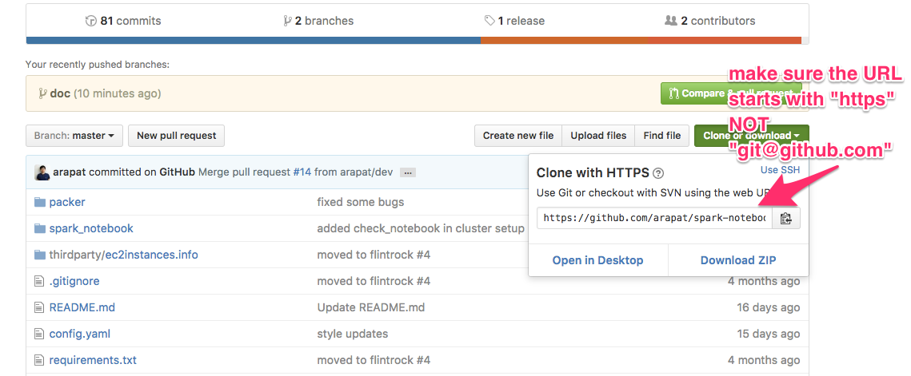

This document covers some tricks to do common tasks on AWS.

### What is the workspace path of the Jupyter notebook?
(Or where should I put files to access them in the Jupyter notebook)

`/mnt/workspace`

### How do I download/upload files from S3/HDFS/home dir *on the cluster* to S3/HDFS/home dir *on the cluster*?

Please refer to [SparkAndS3](SparkAndS3.md).

### How do I transfer files from the cluster's local disk to my laptop's local disk or vice versa?

`scp` is a good option for this task, especially for large files or directories that
contain many files.

The usage of the `scp` command is very similar to `ssh`. So we start by copying the SSH command provided
on the cluster info page. As an example, the SSH command may look like this
`ssh -i ~/vault/mypem.pem hadoop@ec2-54-88-78-22.compute-1.amazonaws.com`.

#### `scp` from the server to the laptop

`scp -r -i ~/vault/mypem.pem hadoop@ec2-54-88-78-22.compute-1.amazonaws.com:</remote/file/path> </local/file/path>`

Replace `</remote/file/path>` and `</local/file/path>` to the actual file paths.

#### `scp` from the laptop to the server

`scp -r -i ~/vault/mypem.pem </local/file/path> hadoop@ec2-54-88-78-22.compute-1.amazonaws.com:</remote/file/path>`

Replace `</remote/file/path>` and `</local/file/path>` to the actual file paths.

The `-r` option above is only required for transferring directories.

### How do I use Git?

At this moment you have to login to the cluster master node to use git.

Copy and paste the SSH login command from the Cluster info page. Once you login, you may like to
navigate to `/mnt/workspace` because only files/directories under this folder can be accessed in
the Jupyter notebook.

#### pull remote repository

1. Open your project on GitHub.
2. Click "Clone or download" button.
3. Click "Use HTTPS" link.
4. Copy the repository HTTPS URL, then run `git clone <HTTPS url>` in the terminal.

You will be asked to type in your GitHub username and password.

**Example:** `git clone git@github.com:arapat/spark-notebook.git`

#### Push to the remote repository

Simply run `git push` in the terminal.

You will be asked to type in your GitHub username and password.
