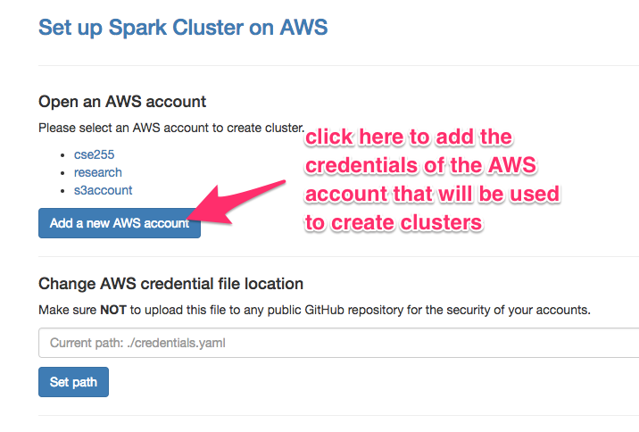
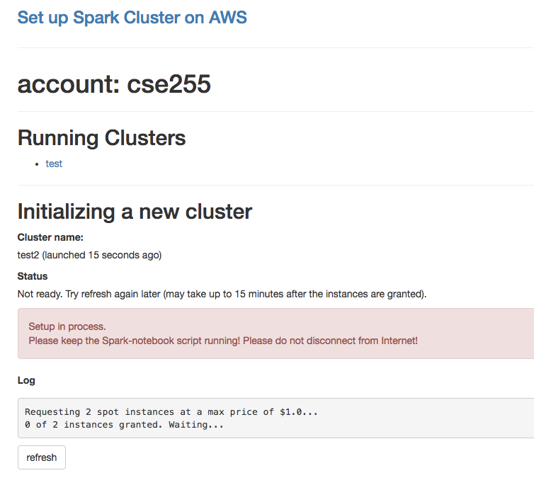
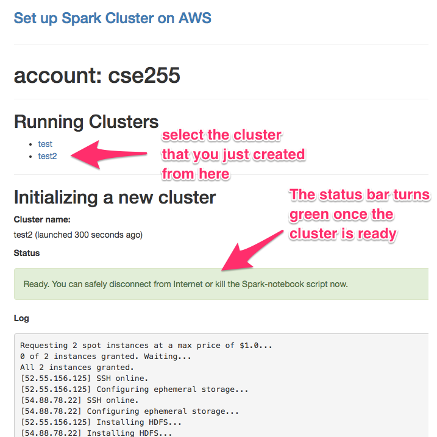
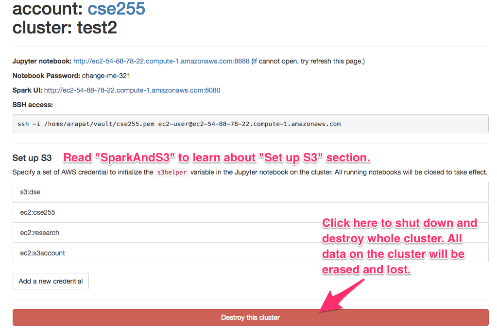

## Create a Spark cluster with common Python libraries on AWS

This software is for creating a Spark cluster on AWS.
In this file, we will show how to do that.

### Installation

It is a good idea to create a virtual environment for `spark-notebook`, especially
if the default `python` on your system is an older version. But it is not a
requirement. [This article](https://hackercodex.com/guide/python-development-environment-on-mac-osx/)
is a good reference if you are new to Python development environment.

* Make sure you have python 3.4 or newer version installed. If not, install it first.

* Create a virtual environment which uses `python3`.

```
virtualenv -p python3 <env_name>
```
* Activate the virtualenv created in step 2.

```
source <env_name>/bin/activate
```
* Install required packages.

```
pip install -r requirements.txt
```


### Usage

If the required packages are installed in a virtualenv, activate the virtualenv first.

```
source <env_name>/bin/activate
```
1. Run `python run.py`.
2. A browser window will automatically open the URL: `http://localhost:5000`.

The port number may be different because spark-notebook will try the next available port when the
default port is occupied.

### Add an AWS account



### Create a new cluster

Click the AWS account that you just created. In the next page, fill the form in the
"Create a new cluster" section to create a Spark cluster.
Click the "Create" button. Now the webpage should refresh and show current setup
status and log. Please keep the script running and keep the Internet connected until
the cluster is ready. You can click the "refresh" button to fetch the latest setup log.



Once the cluster is up, refresh the setup page (at this moment, the page will not automatically refresh after the cluster is up).



### Login to a cluster

By default, the script installed Spark, HDFS, Jupyter notebook and other common
Python libraries on all nodes. The cluster info page provides links to the Jupyter
notebook and the Spark web UI. If you would like to use other languages or run
terminal commands, the info page also provides the SSH login command which you
can copy and paste into your terminal and login to the master node.

For information on setting up S3, please refer to [SparkAndS3](SparkAndS3.md).

For information on login to worker nodes, please refer to [UpgradingSlaves](UpgradingSlaves.md).

There is also a "Destroy this cluster" button on the info page for shutting
down the whole cluster. The operation will remove all data on the cluster,
which cannot be undo.


