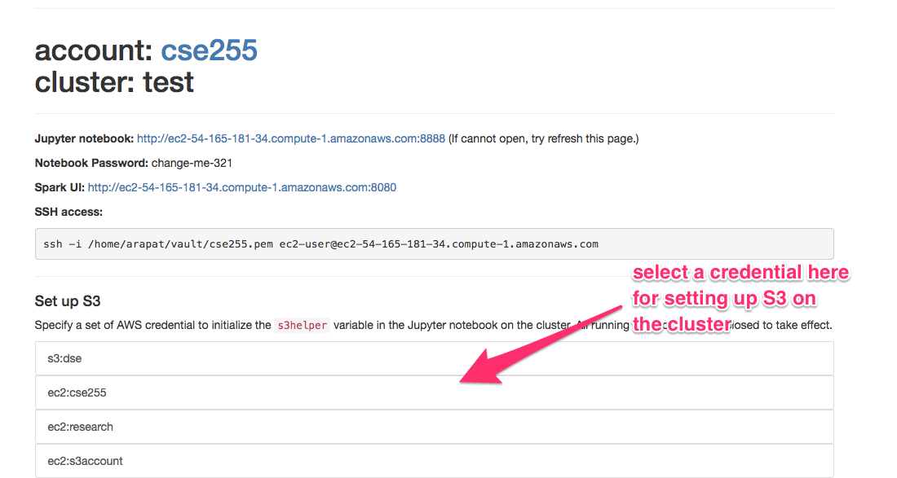

## Create SparkContext `sc` in Jupyter Notebook

Here is a sample code to create a SparkContext variable in a Jupyter Notebook.

```
from pyspark import SparkConf
from pyspark import SparkContext
```

## Set `master_url`

`master_url` stores the URL of the Spark master node. It is created by the
spark-notebook and can be referenced in any Jupyter notebooks.

```
conf = SparkConf().setMaster(master_url)
sc = SparkContext(conf=conf)
```

## Accessing S3

A helper variable `s3helper` is initialized when Jupyter Notebook is launched.
[spark_notebook/remote/examples/FilesIO.ipynb](https://github.com/arapat/spark-notebook/blob/master/spark_notebook/remote/examples/FilesIO.ipynb)
contains examples of using `s3helper`. Alternatively, you can try to call `s3helper.help()`.

### Set up your S3 credentials

By default, `s3helper` uses the credentials of the AWS account that used for creating the cluster.
In the cluster details page, you can change the S3 credentials of the `s3helper` by clicking on
a different credential's name under the "Set up S3" section.


